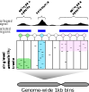

========
Overview
========

**Scregseg** (**S**ingle-**C**ell **REG**ulatory landscape **SEG**mentation) is a tool
that facilitates the analysis of single cell ATAC-seq data by an HMM-based
segmentation algorithm. To this end, Scregseg integrates and extends the hmmlearn package.
In more detail, Scregseg uses an HMM with Dirichlet-Multinomial emission probabilities
to segment the genome either according to distinct relative cross-cell accessibility profiles or
(after collapsing the single-cell tracks to pseudo-bulk tracks) to capture
distinct cross-cluster accessibility profiles.

This enable to

 1. identify informative feature identification (as an alternative to e.g. peak calling)
 2. characterze regulatory programs.

Furthermore, the states and state calls can be annotatated and characterized based on
1) gene set enrichment, 2) marker gene extraction.

Regarding **feature identification**: 

  
The segmentation results can be used to assemble a set of regions of interest reflecting diverse cross-cell accessibility patterns for the downstream clustering analysis (e.g. using cisTopic). This may improve cell type clustering. By contrast, peak calling may not reveal the most informative regions, because it is biased to reveal regions by peak height. That is, peak calling most confidently extracts consitutive accessible regions which are usually the highest peaks but less informative for cell-type identification and it might miss peaks from small cell populations due to their limited peak height.

Regarding **regulatory program identification**: 

   
Instead of employing a differential accessibility analysis (e.g. one-vs-all cluster accessibility) Scregseg reveals distinct cross cell-type accessibility profiles which
allows to not only capture regions specific for single cell type, but also regions shared across cell types.

* Free software: GPL-v3 license

Installation
============

Prior to installing scregseg, numpy and tensorflow must be installed.
Afterwards, type:

::

    pip install git+https://github.com/BIMSBbioinfo/scregseg

scregseg depends on pybedtools which requires bedtools to be installed.
Details instructions on the installation of pybedtools can be found here_.

.. _here: https://daler.github.io/pybedtools/

Troubleshooting
===============

Sometimes bedtools fails when processing downloaded fragment files (*.tsv.gz) as produced by the CellRanger pipeline.
A solution to this issue is to decompress and compress the files again locally.
For instance

::

  gunzip fragments.tsv.gz
  gzip fragments.tsv

Usage
=====

Help on usage of the command-line interface can be optained by 

::

    scregseg -h
    
Various subprograms allow to 1) load, filtered and manipulate count matrices (e.g. bam_to_counts), 2) fit an HMM and segment the genome (fig_segment)
and 3) explore the relationship of the states with additional annotation (e.g. enrichment, annotate, extract_motifs).

Tutorials
=========

The main functionality of the package is covered in several tutorials:

+----------------------------------------------------+
| Example notebooks                                  |
+====================================================+
| `Data preparation`_                                |
+----------------------------------------------------+
| `Using Scregseg on single-cell ATAC-seq tracks`_   |
+----------------------------------------------------+
| `Using Scregseg on cluster-collapsed tracks`_      |
+----------------------------------------------------+

.. _`Data preparation`: https://nbviewer.jupyter.org/github/BIMSBbioinfo/scregseg/blob/master/tutorials/01-preprocessing.ipynb
.. _`Using Scregseg on single-cell ATAC-seq tracks`: https://nbviewer.jupyter.org/github/BIMSBbioinfo/scregseg/blob/master/tutorials/02-scregseg-on-single-cell-ATAC-seq-profiles.ipynb
.. _`Using Scregseg on cluster-collapsed tracks`: https://nbviewer.jupyter.org/github/BIMSBbioinfo/scregseg/blob/master/tutorials/03-scregseg-on-pseudo-bulk-ATAC-seq-profiles.ipynb

